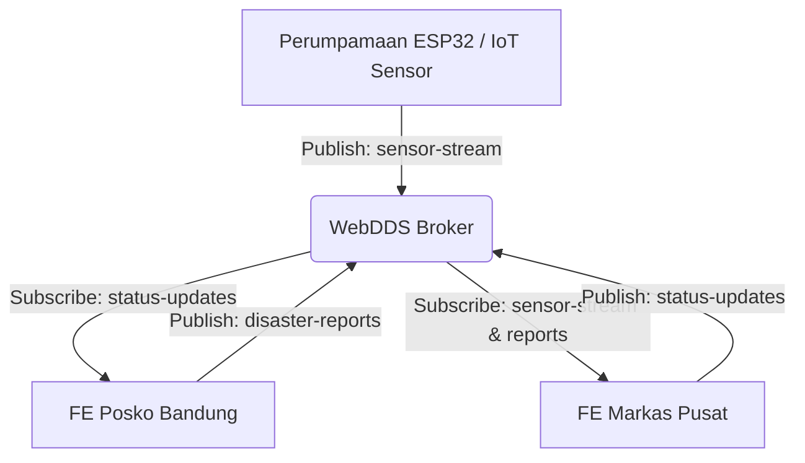

# 🌋 WebDDS Disaster Command System

> **Sistem Pemantauan & Keputusan Bencana Lintas Wilayah Berbasis WebDDS (Data Distribution Service).**

Sistem ini mendemonstrasikan kekuatan arsitektur **Data-Centric Pub/Sub** menggunakan WebDDS. Dirancang untuk koordinasi *real-time* antara Posko Lapangan (FE Posko) dan Markas Pusat (FE Pusat) melalui jalur komunikasi Broker WebSocket yang tangguh.

---

## 🏗️ Arsitektur Aliran Data

Sistem ini tidak menggunakan pola Request-Response (HTTP) biasa, melainkan pola **Pub/Sub** global yang memungkinkan semua komponen berkomunikasi secara asinkron.



---

## 🚀 Fitur Utama

- **📡 Real-Time Pub/Sub**: Pertukaran data instan (< 100ms) tanpa perlu me-refresh halaman.
- **⚙️ QoS (Quality of Service)**: Filter data di sisi server (Broker) sehingga setiap posko hanya menerima data yang relevan bagi mereka.
- **📊 M2M Simulation**: Simulator sensor otomatis yang mengalirkan data streaming secara *live* ke dashboard Pusat.
- **🧠 Atomic State Management**: Sinkronisasi data global menggunakan **Zustand** dengan performa O(1) untuk ribuan laporan.

---

## 🛠️ Teknologi yang Digunakan

| Komponen | Teknologi |
| :--- | :--- |
| **Frontend** | React 18, TypeScript, Rspack (Ultra Fast Bundler) |
| **Styling** | Tailwind CSS |
| **State** | Zustand |
| **Broker Server** | Node.js + WebSocket (ws-broker) |
| **Transport** | WebDDS over WebSocket |

---

## 📦 Panduan Instalasi (Getting Started)

Proyek ini menggunakan **pnpm workspaces (Monorepo)**. Anda hanya perlu menjalan satu perintah instalasi dari folder *root*.

### 1. Prasyarat
- **Node.js** (Versi 18 LTS atau lebih baru)
- **pnpm** (Global package manager). *Install: `npm install -g pnpm`*

### 2. Langkah Instalasi
```bash
# Clone repository ini
git clone https://github.com/awiuweoww/webdds-notification-system.git
cd webdds-notification-system

# Install semua dependensi (Hanya di root)
pnpm install
```

---

## ⚡ Cara Menjalankan

Anda bisa menjalankan seluruh sistem secara bersamaan atau per modul.

### 🌟 Menyalakan Semua (Broker + Apps)
```bash
pnpm dev:all
```
*Pusat: http://localhost:3000 | Posko: http://localhost:3001*

### Menjalankan Per Modul
Jika Anda ingin fokus pada bagian tertentu:

| Modul | Perintah | Port |
| :--- | :--- | :--- |
| **WebDDS Broker** | `pnpm dev:broker` | `8081` |
| **Markas Pusat** | `pnpm dev:pusat` | `3000` |
| **Posko Lapangan** | `pnpm dev:posko` | `3001` |


---

## 🗺️ Peta Aliran Data (End-to-End)

Berikut adalah perjalanan data dari saat operator menginput laporan di lapangan hingga muncul secara otomatis di layar pusat pusat:

1.  **Komponen React (Input Data)**:
    *   **Siapa**: `FE-Posko (Bandung)`
    *   **Aksi**: Operator mengisi formulir pelaporan dan mengeklik tombol **Submit**.
2.  **Hooks (Publish Topik)**:
    *   **Siapa**: `useDisasterForm.ts`
    *   **Aksi**: Hook mengonversi data form menjadi paket JSON dan melakukan **Publish** ke topik `disaster-reports` melalui service WebDDS.
3.  **Broker (Relay Data)**:
    *   **Siapa**: `ws-broker (Node.js WebSocket)`
    *   **Aksi**: Broker menerima paket, memverifikasi topik, dan melakukan **Relay** (meneruskan) salinan data tersebut ke semua client yang berlangganan.
4.  **Hooks (Subscribe Topik)**:
    *   **Siapa**: `useDisasterSync.ts` di sisi **FE Pusat**.
    *   **Aksi**: Hook yang sedang "mendengarkan" topik tersebut langsung menangkap paket data yang dilempar oleh Broker tanpa jeda.
5.  **Store (Update Global State)**:
    *   **Siapa**: `useDisasterStore.ts` (Zustand).
    *   **Aksi**: Memperbarui status global aplikasi (`reportsList`) dengan menyisipkan data baru tersebut ke dalam memori aplikasi.
6.  **Komponen React (Re-render Tampilan)**:
    *   **Siapa**: `DisasterTable.tsx` di sisi **FE Pusat**.
    *   **Aksi**: Karena data di Store berubah, React mendeteksi perubahan tersebut dan **me-render ulang** tabel sehingga laporan baru dari Bandung muncul seketika di layar.

---

## 📡 Rincian Topik & Pub/Sub

Sistem ini didasarkan pada pembagian tugas melalui saluran (**Topic**) yang spesifik:

| Nama Topik (Topic Name) | Publisher (Si Pengirim) | Subscriber (Si Penerima) | Fungsi Data (Purpose) |
| :--- | :--- | :--- | :--- |
| **`disaster-reports`** | **FE Posko** (Laporan Lapangan) | **FE Pusat** (Dashboard Komando) | Penyaluran laporan bencana manual dari unit lapangan ke pusat komando. |
| **`status-updates`** | **FE Pusat** (Respon/Keputusan) | **FE Posko** (Unit Terkait) | Penyaluran respon atau update penanganan yang ditargetkan secara spesifik (**Filtered**). |
| **`sensor-stream`** | **Broker Server** (Simulator IoT) | **FE Pusat** (Dashboard Monitoring) | Aliran data otomatis (Streaming) dari sensor lapangan tanpa intervensi manusia (M2M). |

### **Detail Teknis Lokasi Kode:**

#### **1. Topik: `disaster-reports`**
- **Aksi Publish**: `apps/fe-posko/src/hooks/useDisasterForm.ts`
- **Aksi Subscribe**: `apps/fe-pusat/src/hooks/useDisasterSync.ts`
- **Isi Data**: Detail jenis bencana, koordinat (DMM format), dan tingkat keparahan (Level 0-3).

#### **2. Topik: `status-updates`**
- **Aksi Publish**: `apps/fe-pusat/src/components/modal/ReportDetailModal.tsx`
- **Aksi Subscribe**: `apps/fe-posko/src/hooks/usePoskoSync.ts`
- **QoS Filtering**: Menggunakan filter `targetPoskoId` untuk memastikan notifikasi hanya sampai ke posko yang bersangkutan (Server-Side Filtering).

#### **3. Topik: `sensor-stream`**
- **Aksi Publish**: `server/ws-broker/src/index.ts` (Fungsi `publishSensorData`).
- **Aksi Subscribe**: `apps/fe-pusat/src/hooks/useDisasterSync.ts`
- **Isi Data**: Data sensor otomatis dari stasiun pemantau (misal: "Sensor Gunung Merapi").

---

## 🛣️ Roadmap Pengembangan
- [x] Implementasi WebDDS Pub/Sub (WebSocket).
- [x] Implementasi Server-Side QoS Filtering.

---

